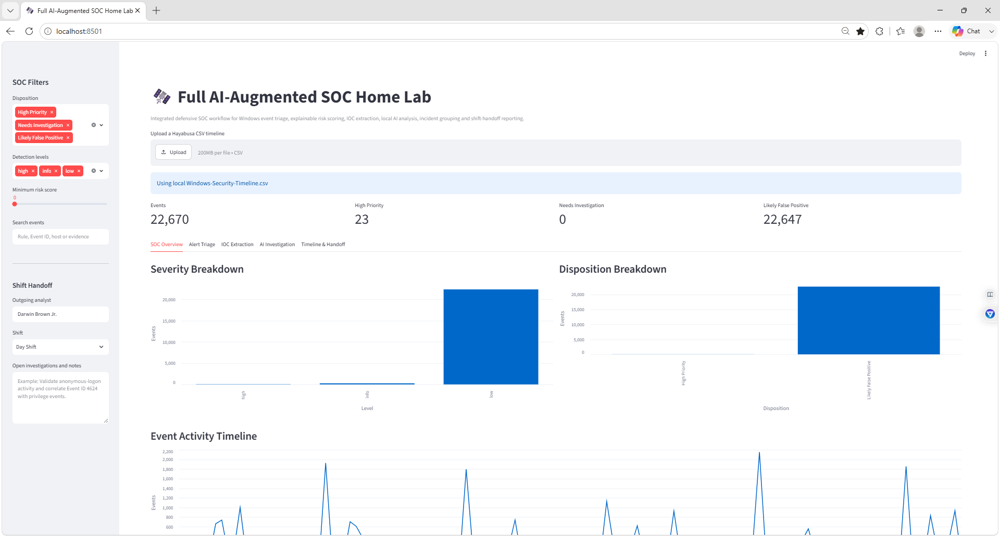
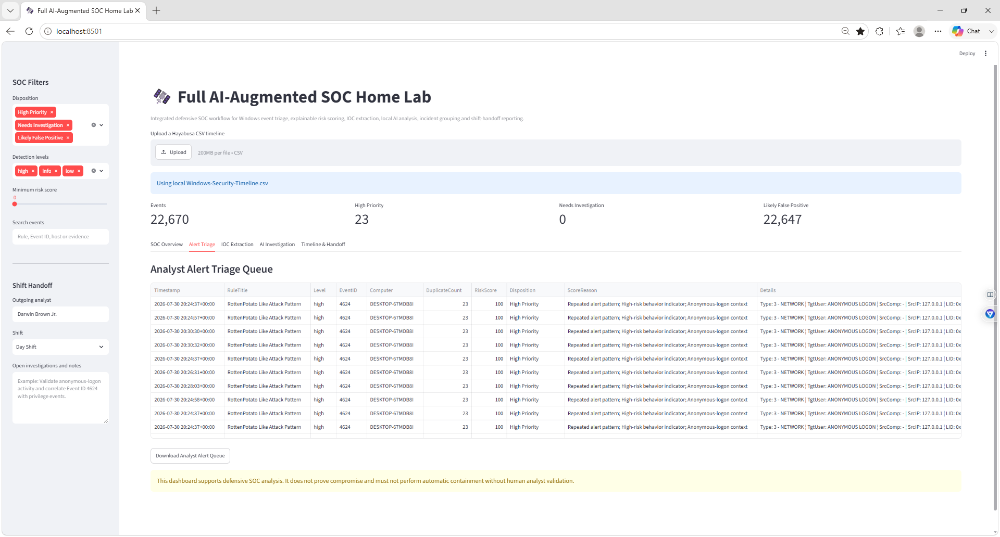
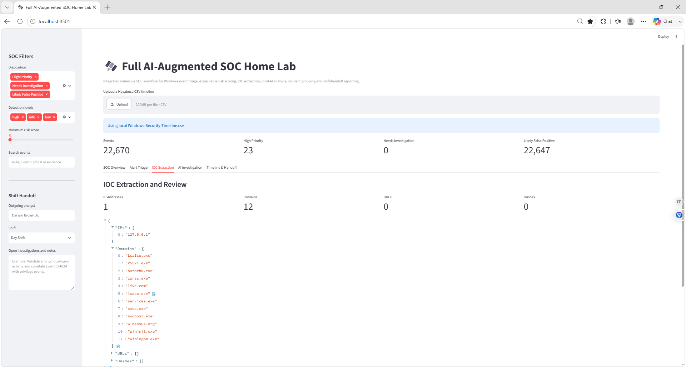
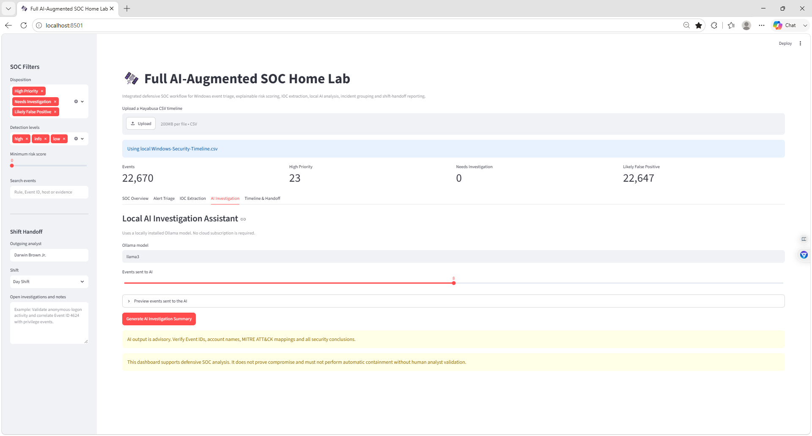
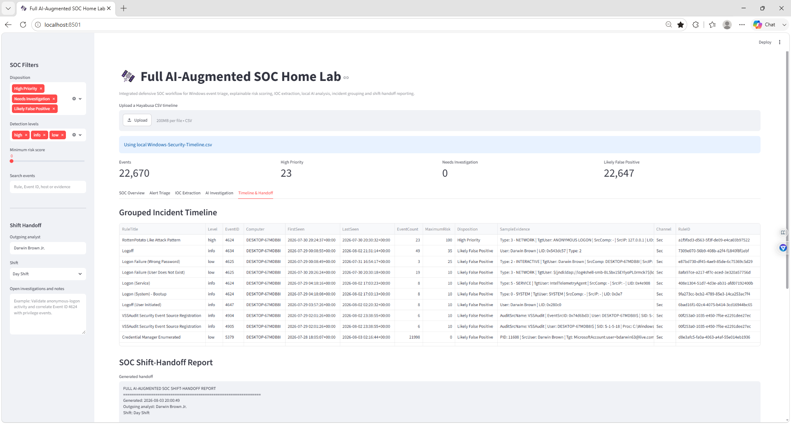

# Darwin-Full-SOC-AI-Augmented-SOC-Home-Lab
Advanced SOC home lab combining Hayabusa Windows log analysis, explainable alert scoring, IOC extraction, local Ollama AI triage, incident grouping, analyst queues, and downloadable shift-handoff reporting.


The application combines several SOC Tier 1 workflows into one dashboard:

- Windows event-log analysis
- Explainable alert scoring
- False-positive reduction
- Alert prioritization
- IOC extraction
- Local AI-assisted investigation
- Incident grouping
- Analyst queue export
- SOC shift-handoff reporting

> This project is a defensive investigation and training lab. Automated scores, detection-rule matches, extracted indicators, and AI-generated conclusions must be validated by a human analyst.

---

## 🎯 Project Objectives

- Load a Hayabusa Windows Security timeline
- Normalize important event fields
- Review severity and detection-rule activity
- Score alerts using transparent local logic
- Identify repeated and duplicate alert patterns
- Classify alerts by analyst disposition
- Extract potential IPs, domains, URLs, and hashes
- Send selected alerts to a local Ollama model
- Generate investigation recommendations
- Group related alerts into incident summaries
- Create a downloadable SOC shift-handoff report
- Preserve human approval before escalation or containment

---

## 🧠 Why This Project Matters

SOC analysts often work across several disconnected tools.

A normal investigation may require an analyst to:

1. Review a SIEM alert.
2. Open the original Windows event.
3. Determine the severity.
4. Identify repeated detections.
5. Extract indicators of compromise.
6. Search for related events.
7. Summarize the findings.
8. Decide whether to monitor, investigate, or escalate.
9. Document the work for the next shift.

This application brings those activities into one local workflow.

The dashboard does not replace a SIEM, EDR platform, incident-response playbook, or human analyst. It demonstrates how automation and local AI can support a junior SOC analyst while keeping the logic visible and reviewable.

---

## 🛠️ Technologies Used

- Python
- Streamlit
- Pandas
- Hayabusa
- Windows Security Event Logs
- PowerShell
- CSV
- JSON
- Regular expressions
- Ollama
- Llama 3
- SOC Tier 1 investigation methods
- Human-in-the-loop security analysis

---

## 🏗️ Lab Architecture

```text
Windows Security Event Log
            ↓
Exported Security.evtx
            ↓
Hayabusa Detection Analysis
            ↓
Windows-Security-Timeline.csv
            ↓
Python and Pandas Processing
            ↓
Explainable Risk Scoring
            ↓
Alert Disposition Assignment
            ↓
IOC Extraction
            ↓
Local Ollama AI Investigation
            ↓
Grouped Incident Timeline
            ↓
SOC Shift-Handoff Report
            ↓
Human Analyst Validation
```

---

## 📁 Repository Structure

```text
Darwin-Full-AI-Augmented-SOC-Home-Lab/
│
├── soc_dashboard.py
├── requirements.txt
├── README.md
├── .gitignore
│
├── screenshots/
│   ├── 01-Full-AI-SOC-Home-Lab-Overview.png
│   ├── 02-AI-SOC-Alert-Triage-Queue.png
│   ├── 03-AI-SOC-IOC-Extraction.png
│   ├── 04-AI-SOC-Investigation-Summary.png
│   └── 05-AI-SOC-Incident-Timeline-Handoff.png
│
├── data/
├── reports/
└── rules/
```

The original Windows timeline is excluded because it may contain:

- Usernames
- Computer names
- IP addresses
- Security identifiers
- Logon IDs
- Process details
- Account information
- Authentication data

---

## ⚙️ Environment Setup

### 1. Create the project folder

```powershell
cd "C:\Users\Darwin Brown\Downloads"
mkdir Full-AI-SOC-Home-Lab
cd .\Full-AI-SOC-Home-Lab
```

### 2. Create a Python virtual environment

```powershell
python -m venv socvenv
```

### 3. Activate the environment

```powershell
.\socvenv\Scripts\Activate.ps1
```

### 4. Install the required packages

```powershell
python -m pip install streamlit pandas pyyaml requests ollama
```

### 5. Create the supporting folders

```powershell
mkdir screenshots, reports, rules, data
```

If PowerShell reports that a folder already exists, it can be ignored.

### 6. Copy the Hayabusa timeline

```powershell
Copy-Item "C:\Users\Darwin Brown\Downloads\hayabusa-3.10.0-win-x64\Windows-Security-Timeline.csv" ".\Windows-Security-Timeline.csv"
```

---

## ▶️ Running the Dashboard

Start the application with:

```powershell
streamlit run soc_dashboard.py
```

If the command is not recognized, run:

```powershell
.\socvenv\Scripts\streamlit.exe run soc_dashboard.py
```

Open the application at:

```text
http://localhost:8501
```

Keep the PowerShell window open while using the dashboard.

---

## 📥 Supported Input

The dashboard accepts a Hayabusa CSV timeline through:

- The local `Windows-Security-Timeline.csv` file
- The Streamlit upload control

The application searches for and normalizes fields such as:

```text
Timestamp
RuleTitle
Level
EventID
Computer
Details
Channel
RuleID
```

This allows the application to tolerate small differences in CSV column names.

---

# Dashboard Sections

## 1. SOC Overview

The SOC Overview provides a high-level summary of the loaded event data.

It displays:

- Total event count
- High-priority event count
- Events needing investigation
- Estimated likely false positives
- Severity distribution
- Disposition distribution
- Event activity over time
- Top detection rules
- Analyst filters
- Shift-handoff settings

During this lab, the dashboard processed:

```text
22,670 events
23 high-priority alerts
0 alerts needing investigation
22,647 likely false positives
```

These results are based on the local demonstration scoring model and should not be interpreted as production-grade classifications.

---

## 2. Alert Triage Queue

The Alert Triage tab creates a focused analyst queue.

Each alert contains:

- Timestamp
- Rule title
- Severity
- Event ID
- Computer
- Duplicate count
- Risk score
- Disposition
- Scoring explanation
- Original event details

The dashboard classifies alerts as:

```text
High Priority
Needs Investigation
Likely False Positive
```

The alert queue can be downloaded as:

```text
AI-SOC-Alert-Queue.csv
```

---

## 🔢 Explainable Risk Scoring

The application uses local rule-based scoring.

Example starting scores:

| Detection level | Starting score |
|---|---:|
| Critical | 100 |
| High | 80 |
| Medium | 55 |
| Low | 25 |
| Informational | 10 |

The score can be adjusted using event context.

### Repeated alert pattern

```text
-15 points
```

Repeated alerts may indicate noise, but they may also represent repeated malicious activity. Duplicate count is only one signal.

### High-risk behavior indicator

```text
+25 points
```

Example terms include:

```text
RottenPotato
Mimikatz
Credential Dumping
PowerShell
Ransomware
Malware
Privilege Escalation
Anonymous Logon
Persistence
Lateral Movement
```

### Possible routine Windows activity

```text
-20 points
```

Examples include:

```text
Windows startup
User-initiated logoff
Firewall service startup
Event logging service activity
Routine credential events
```

### Anonymous logon context

```text
+15 points
```

Anonymous-logon activity requires additional validation but is not automatically malicious.

### Missing computer context

```text
-10 points
```

Missing host information reduces confidence in the alert.

---

## 🚦 Disposition Thresholds

```text
75–100: High Priority
40–74:  Needs Investigation
0–39:   Likely False Positive
```

These thresholds were created for the lab and should be tuned before use in another environment.

A low score does not prove an alert is benign.

A high score does not prove compromise.

---

## 3. IOC Extraction

The IOC Extraction tab searches event details for:

- IP addresses
- Domains
- URLs
- MD5 hashes
- SHA-1 hashes
- SHA-256 hashes

The extracted indicators can be downloaded as:

```text
Extracted-IOCs.json
```

During the demonstration, the application extracted:

```text
1 IP address
12 possible domains
0 URLs
0 hashes
```

The IP address shown was:

```text
127.0.0.1
```

This is a loopback address and is not a public attacker address.

---

## ⚠️ IOC Extraction Limitation

The first version incorrectly classified process names such as:

```text
lsass.exe
svchost.exe
winlogon.exe
services.exe
```

as domains because the domain regular expression recognized the `.exe` suffix as though it were a top-level domain.

These are Windows executable names, not domains.

A future version should exclude common file extensions such as:

```text
.exe
.dll
.sys
.ps1
.bat
.cmd
.msi
.scr
```

This is an important example of why automatically extracted indicators require human validation.

---

## 4. Local AI Investigation Assistant

The AI Investigation tab uses a local Ollama model.

The default model is:

```text
llama3
```

The analyst can select how many high-risk events are sent to the model.

The local model is asked to provide:

1. Executive summary
2. Highest-risk event
3. Suspicious behavior explanation
4. Windows Event ID meaning
5. Possible MITRE ATT&CK techniques
6. Missing evidence or context
7. Recommended investigation steps
8. Monitor, investigate, or escalate disposition

The prompt instructs the model to:

- Avoid claiming compromise without evidence
- Avoid automatic containment recommendations
- Treat Sigma and Hayabusa matches as investigation leads
- Recognize legitimate Windows entities such as `NT AUTHORITY`
- Mention possible false positives
- Produce an analyst-friendly handoff summary

---

## 🤖 Running Ollama

Confirm the local model is installed:

```powershell
ollama list
```

Start or test Llama 3:

```powershell
ollama run llama3
```

The Streamlit application communicates with the locally installed Ollama service.

No paid cloud model is required.

---

## 🧠 AI Validation Requirements

The AI output must be checked for:

- Incorrect Event ID meanings
- Unsupported MITRE ATT&CK mappings
- Misidentified Windows accounts
- Incorrect conclusions about `NT AUTHORITY`
- Overstated severity
- Missing organizational context
- False assumptions about source IPs
- Incorrect containment recommendations

The AI acts as an investigation assistant, not the final decision-maker.

---

## 5. Incident Timeline and Shift Handoff

The final dashboard tab groups repeated detections using:

```text
Rule title
Severity
Event ID
Computer
```

Each grouped incident contains:

- First-seen timestamp
- Last-seen timestamp
- Event count
- Maximum risk score
- Disposition
- Sample evidence
- Channel
- Rule ID

The application then generates a SOC shift-handoff report.

The report includes:

- Generation time
- Outgoing analyst
- Shift name
- Event count
- Priority-alert count
- Investigation count
- Likely false-positive count
- Unique hosts
- Unique rules
- Priority incidents
- Incoming analyst actions
- Analyst notes
- Validation reminder

The report can be downloaded as:

```text
AI-SOC-Shift-Handoff.txt
```

---

## 🚨 Primary Detection Reviewed

The highest-priority alert in the lab was:

```text
RottenPotato Like Attack Pattern
```

The event details included:

```text
Event ID: 4624
Severity: High
Target user: ANONYMOUS LOGON
Source IP: 127.0.0.1
Logon type: Network
Occurrences: 23
Risk score: 100
Disposition: High Priority
```

Event ID 4624 represents a successful account logon.

A successful logon is not automatically malicious.

The analyst should investigate:

- Logon type
- Target username
- Target domain
- Authentication package
- Source IP
- Source port
- Source workstation
- Logon ID
- Process information
- Related privilege events
- Related process-creation events
- Host role
- Whether the activity was expected

---

## 🛡️ Recommended SOC Tier 1 Investigation Steps

1. Validate the Hayabusa detection against the original Windows event.
2. Review the complete Event ID 4624 details.
3. Confirm the logon type and authentication package.
4. Identify the target account and target domain.
5. Determine whether anonymous logons are expected.
6. Confirm whether `127.0.0.1` activity was locally generated.
7. Correlate the Logon ID with related events.
8. Review process-creation events such as Event ID 4688.
9. Review privilege events such as Event IDs 4672 and 4673.
10. Check EDR telemetry for related processes and network connections.
11. Compare the event with approved administrative work.
12. Document false-positive explanations.
13. Escalate only when supporting evidence exists.
14. Avoid automatic containment without analyst validation.

---

## 📸 Screenshots

### 1. Full AI SOC Home Lab Overview



The overview displays:

- 22,670 total events
- 23 high-priority alerts
- 22,647 likely false positives
- Severity breakdown
- Disposition breakdown
- Event activity timeline
- SOC filters
- Shift-handoff controls
- Five investigation tabs

---

### 2. AI SOC Alert Triage Queue



The triage queue shows:

- Event ID 4624
- RottenPotato-like detection
- Duplicate count of 23
- Risk score of 100
- High-priority disposition
- Explainable scoring reasons
- Original event evidence
- Downloadable analyst queue

---

### 3. AI SOC IOC Extraction



The IOC view shows:

- Extracted IP addresses
- Possible domains
- URLs
- Hashes
- JSON-formatted output

The screenshot also demonstrates the limitation where Windows executable names were incorrectly treated as domains.

---

### 4. AI SOC Investigation Summary



The local Ollama assistant can generate:

- Executive summary
- Highest-risk alert
- Event ID explanation
- Suspicious behavior analysis
- MITRE ATT&CK suggestions
- Missing-context warnings
- Investigation steps
- Final disposition

Upload this screenshot after the local Llama 3 analysis has completed.

---

### 5. AI SOC Incident Timeline and Handoff



The final tab shows:

- Grouped incident timeline
- First and last detection times
- Event count
- Maximum risk
- Alert disposition
- Sample event evidence
- Generated shift-handoff report
- Outgoing analyst and shift information

---

## 📊 Additional Detections Visible

The grouped incident timeline also contained events such as:

- Logoff
- Failed logon due to wrong password
- Failed logon for a nonexistent user
- Service logon
- System boot logon
- User-initiated logoff
- Security event-source registration
- Credential Manager enumeration

These events require different levels of investigation depending on:

- Frequency
- Host role
- User account
- Timing
- Source address
- Related detections
- Organizational baseline

---

## 🧠 Human-in-the-Loop Design

The application does not automatically:

- Close alerts
- Block indicators
- Isolate endpoints
- Disable accounts
- Terminate processes
- Suppress detection rules
- Confirm incidents
- Escalate cases
- Mark activity as malicious

The analyst remains responsible for:

- Evidence review
- Alert validation
- False-positive determination
- MITRE ATT&CK accuracy
- Containment approval
- Escalation decisions
- Final documentation

---

## ⚠️ Current Limitations

- Demonstration scoring thresholds
- No official SIEM integration
- No EDR API integration
- No threat-intelligence API integration
- No asset criticality
- No user behavioral baseline
- No host behavioral baseline
- No persistent case database
- No alert ownership
- No case status tracking
- IOC regex may classify filenames as domains
- AI output may contain incorrect conclusions
- Duplicate alerts may represent either noise or repeated attacks
- No automatic validation against raw `.evtx` files
- No authentication for the Streamlit dashboard

---

## 🚀 Future Improvements

- Exclude executable extensions from domain extraction
- Add IPv6 support
- Add email and registry IOC extraction
- Add VirusTotal enrichment
- Add AbuseIPDB enrichment
- Add URLhaus enrichment
- Add MITRE ATT&CK validation
- Add Sigma-rule validation
- Add Microsoft Sentinel integration
- Add Splunk integration
- Add Elastic integration
- Add Microsoft Defender XDR integration
- Add asset-criticality scoring
- Add user and host baselines
- Add case ownership
- Add analyst comments
- Add incident status tracking
- Add SQLite storage
- Add PDF report export
- Add authentication
- Add detection-rule tuning recommendations
- Add alert suppression recommendations
- Add false-positive feedback loops
- Add multiple Ollama model support
- Compare AI conclusions against rule-based analysis
- Add confidence scoring
- Add automated test datasets

---

## 🧠 What I Learned

- How to combine several SOC workflows into one dashboard
- How to process Hayabusa timelines with Pandas
- How to normalize Windows event fields
- How to create explainable alert scores
- How to classify alerts by disposition
- How to detect repeated alert patterns
- How to extract potential IOCs
- How regular expressions can create false positives
- How to use a local Ollama model
- How to prepare security events for AI analysis
- How to group alerts into incidents
- How to generate SOC shift-handoff reports
- How to export analyst queues and reports
- Why AI conclusions require human validation
- Why security automation must remain explainable

---

## 💼 Skills Demonstrated

- SOC Tier 1 alert triage
- Windows Event Log analysis
- Hayabusa
- Sigma-based detection analysis
- Python
- Streamlit
- Pandas
- PowerShell
- CSV processing
- JSON processing
- IOC extraction
- Regular expressions
- False-positive analysis
- Risk scoring
- Alert prioritization
- Incident grouping
- Timeline analysis
- Local LLM integration
- Ollama
- AI-assisted investigation
- Shift-handoff reporting
- Security automation
- Human-in-the-loop validation
- Incident documentation

---

## 🔐 Privacy and Evidence Handling

Windows event data may contain:

- Personal usernames
- Email addresses
- Computer names
- Domain names
- Security identifiers
- IP addresses
- Process names
- Logon IDs
- Account information
- Authentication details

Before publishing:

- Remove personal identifiers
- Redact usernames and email addresses
- Redact private hostnames
- Do not upload private company logs
- Do not upload API keys
- Do not upload credentials
- Do not publish unredacted `.evtx` files
- Use synthetic or personally controlled data

---

## 🧹 Recommended `.gitignore`

```gitignore
socvenv/
venv/
.env
__pycache__/
*.pyc
*.log
*.evtx

Windows-Security-Timeline.csv
AI-SOC-Alert-Queue.csv
Extracted-IOCs.json
AI-Investigation-Summary.txt
AI-SOC-Shift-Handoff.txt

data/*
reports/*
!data/.gitkeep
!reports/.gitkeep
```

---

## 📦 Suggested `requirements.txt`

```text
streamlit
pandas
PyYAML
requests
ollama
```

Create it manually or run:

```powershell
python -m pip freeze > requirements.txt
```

A manually maintained file containing only direct dependencies is cleaner for a portfolio repository.

---

## ⚠️ Disclaimer

This project was completed in a controlled environment using Windows event data from a personally controlled system.

It is intended only for:

- Cybersecurity education
- SOC analyst training
- Defensive-security research
- Incident-response practice
- AI-assisted security experimentation
- Portfolio development

No unauthorized systems were accessed.

Automated output must not be used as the sole basis for containment, disciplinary action, or incident confirmation.

---

## 🙏 Project Credit

This project uses a Windows event timeline generated by **Hayabusa**, an open-source threat-hunting and fast-forensics tool maintained by Yamato Security.

This repository documents my own:

- Streamlit application
- Event normalization
- Explainable scoring engine
- Alert dispositions
- IOC extraction
- Local Ollama integration
- AI investigation workflow
- Incident grouping
- Analyst queue export
- Shift-handoff generation
- Screenshots
- SOC Tier 1 investigation process

- Author: Darwin Brown
- Aspiring SOC Tier 1
